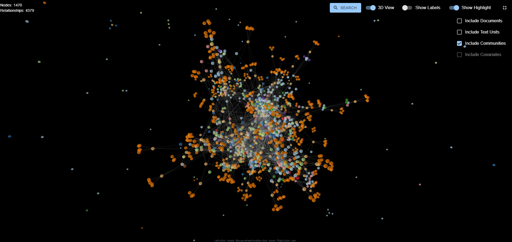

# GraphRAG Visualizer

👉 [GraphRAG Visualizer](https://noworneverev.github.io/graphrag-visualizer/)<br/>
👉 [GraphRAG Visualizer Demo](https://www.youtube.com/watch?v=Hjx1iTZZtzw)



## Overview

GraphRAG Visualizer is an application designed to visualize Microsoft [GraphRAG](https://github.com/microsoft/graphrag) artifacts. By uploading parquet files generated from the GraphRAG indexing pipeline, users can easily view and analyze data without needing additional software or scripts.

## Important Note

If you are using **GraphRAG 0.3.x or below**, please use the legacy version of GraphRAG Visualizer available at:  
👉 [GraphRAG Visualizer Legacy](https://noworneverev.github.io/graphrag-visualizer-legacy)

## Features

- **Graph Visualization**: View the graph in 2D or 3D in the "Graph Visualization" tab.
- **Data Tables**: Display data from the parquet files in the "Data Tables" tab.
- **Search Functionality**: Fully supports search, allowing users to focus on specific nodes or relationships.
- **Local Processing**: All artifacts are processed locally on your machine, ensuring data security and privacy.

## Using the Search Functionality

Once the [graphrag-api](https://github.com/noworneverev/graphrag-api) server is up and running, you can perform searches directly through the GraphRAG Visualizer. Simply go to the [GraphRAG Visualizer](https://noworneverev.github.io/graphrag-visualizer/) and use the search interface to query the API server. This allows you to easily search and explore data that is hosted on your local server.


## Graph Data Model

The logic for creating relationships for text units, documents, communities, and covariates is derived from the [GraphRAG import Neo4j Cypher notebook](https://github.com/microsoft/graphrag/blob/main/examples_notebooks/community_contrib/neo4j/graphrag_import_neo4j_cypher.ipynb).

### Nodes

| Node      | Type           |
| --------- | -------------- |
| Document  | `RAW_DOCUMENT` |
| Text Unit | `CHUNK`        |
| Community | `COMMUNITY`    |
| Finding   | `FINDING`      |
| Covariate | `COVARIATE`    |
| Entity    | _Varies_       |

### Relationships

| Source Node | Relationship    | Target Node |
| ----------- | --------------- | ----------- |
| Entity      | `RELATED`       | Entity      |
| Text Unit   | `PART_OF`       | Document    |
| Text Unit   | `HAS_ENTITY`    | Entity      |
| Text Unit   | `HAS_COVARIATE` | Covariate   |
| Community   | `HAS_FINDING`   | Finding     |
| Entity      | `IN_COMMUNITY`  | Community   |

## Developer Instructions

### Setting Up the Project

1. Clone the repository to your local machine:

   ```bash
   git clone https://github.com/noworneverev/graphrag-visualizer.git
   cd graphrag-visualizer
   ```

2. Install the necessary dependencies:

   ```bash
   npm install
   ```

3. Run the development server:

   ```bash
   npm start
   ```

4. Open the app in your browser:
   ```
   http://localhost:3000
   ```

### Loading Parquet Files

To load `.parquet` files automatically when the application starts, place your Parquet files in the `public/artifacts` directory. These files will be loaded into the application for visualization and data table display. The files can be organized as follows:

- GraphRAG v2.x.x
  - `public/artifacts/entities.parquet`
  - `public/artifacts/relationships.parquet`
  - `public/artifacts/documents.parquet`
  - `public/artifacts/text_units.parquet`
  - `public/artifacts/communities.parquet`
  - `public/artifacts/community_reports.parquet`
  - `public/artifacts/covariates.parquet`

- GraphRAG v1.x.x
  - `public/artifacts/create_final_entities.parquet`
  - `public/artifacts/create_final_relationships.parquet`
  - `public/artifacts/create_final_documents.parquet`
  - `public/artifacts/create_final_text_units.parquet`
  - `public/artifacts/create_final_communities.parquet`
  - `public/artifacts/create_final_community_reports.parquet`
  - `public/artifacts/create_final_covariates.parquet`

If the files are placed in the `public/artifacts` folder, the app will automatically load and display them on startup.
